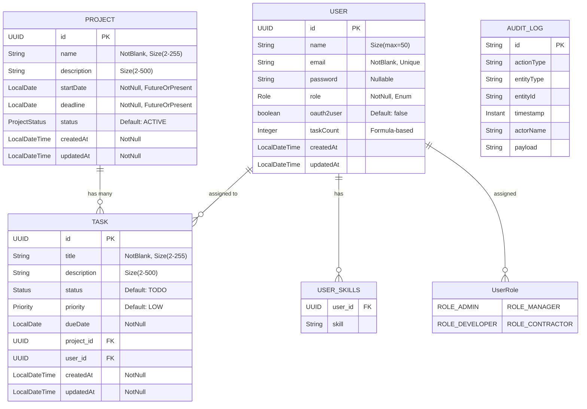

# Project Tracker API


## Overview

The Project Tracker API is a comprehensive backend solution for BuildMaster, a rapidly growing startup that needs better visibility into team performance and project progress. This Spring Boot application provides robust project management capabilities with relational data persistence (using Spring Data JPA with PostgresSQL) and NoSQL integration (MongoDB for audit logs).

## Features

- **Multi-entity management**: Projects, Tasks, and Developers with proper JPA relationships
- **Advanced querying**: Pagination, sorting, and custom JPQL queries
- **Performance optimisation**: Caching and transaction management
- **Audit logging**: All changes tracked in MongoDB
- **RESTful API**: Comprehensive endpoints for all operations

---

## Entity Model


---
## Tech Stack

- **Backend**: Spring Boot 3.1
- **Database**:
    - Relational: PostgreSQL
    - NoSQL: MongoDB
- **ORM**: Spring Data JPA (Hibernate)
- **Caching**: Spring Cache
- **API Documentation**: OpenAPI 3.0 (Swagger)
- **Testing**: JUnit 5

---
## Getting Started

### Prerequisites

- Java 21
- Maven 3.8+
- Docker (for MongoDB container, Postgre )
- Configure .env for application.properties
### Installation

1. Clone the repository:
   ```bash
   git clone https://github.com/thenoblet/project-tracker.git
   cd project-tracker
   ```

2. Start Docker:
   ```bash
   docker compose up
   ```

3. Build and run the application:
   ```bash
   mvn spring-boot:run
   ```
---
## API ENDPOINTS

| Method | Endpoint                          | Description                                  | Parameters/Request Body                     |
|--------|-----------------------------------|----------------------------------------------|---------------------------------------------|
| GET    | `/api/v1/projects`                | Get paginated list of projects               | `pageable`, `includeTasks` (query)          |
| POST   | `/api/v1/projects`                | Create a new project                         | `CreateProjectRequest` (body)               |
| GET    | `/api/v1/projects/{id}`           | Get project by ID                            | `id` (path)                                 |
| PUT    | `/api/v1/projects/{id}`           | Update entire project                        | `id` (path), `UpdateProjectRequest` (body)  |
| PATCH  | `/api/v1/projects/{id}`           | Partial update of project                    | `id` (path), `UpdateProjectRequest` (body)  |
| DELETE | `/api/v1/projects/{id}`           | Delete project                               | `id` (path)                                 |
| PATCH  | `/api/v1/projects/{id}/status`    | Update project status                        | `id` (path), `status` (query)               |
| GET    | `/api/v1/projects/{id}/tasks`     | Get tasks for project                        | `id` (path), filters (query), `pageable`    |
| GET    | `/api/v1/projects/{id}/tasks/overdue` | Get overdue tasks for project             | `id` (path), `pageable`                     |


Visit [ALL API ENDPOINTS](src/main/java/gtp/docs/ENDPOINTS.md) to see the full list of all endpoints

For complete API documentation, visit the Swagger UI at `http://localhost:8080/swagger-ui.html` when the application is running.

---

## Authentication Sequence Diagram

````mermaid
sequenceDiagram
    actor User
    participant Client
    participant AuthController
    participant AuthService
    participant Database
    participant JwtProvider
    participant GoogleOAuth

    Note over User,GoogleOAuth: Email/Password Login
    User->>Client: Enter credentials
    Client->>AuthController: POST /login
    AuthController->>AuthService: login(request)
    AuthService->>Database: findByEmail() + validate password
    Database-->>AuthService: User details
    AuthService->>JwtProvider: generateToken()
    JwtProvider-->>AuthService: JWT
    AuthService-->>Client: JWT + user info

    Note over User,GoogleOAuth: Google OAuth2 Login
    User->>Client: Click "Sign in with Google"
    Client->>GoogleOAuth: Redirect to Google
    GoogleOAuth-->>Client: Authorization code
    Client->>AuthController: OAuth2 callback
    AuthController->>Database: findOrCreateUser()
    Database-->>AuthController: User details
    AuthController->>JwtProvider: generateToken()
    JwtProvider-->>AuthController: JWT
    AuthController-->>Client: JWT + user info

    Note over User,GoogleOAuth: Protected Endpoints
    Client->>AuthController: Request with JWT header
    AuthController->>JwtProvider: validateToken()
    JwtProvider-->>AuthController: Valid
    AuthController-->>Client: Protected data
````

---

## Advanced Features

### Caching

Frequently accessed endpoints are cached for better performance:

```java
@Cacheable("projects")
@GetMapping("/{id}")
public Project getProjectById(@PathVariable UUID id) {
    // ...
}
```

### Transaction Management

Complex operations are wrapped in transactions:

```java
@Transactional
public void deleteProjectWithTasks(UUID projectId) {
    taskRepository.deleteByProjectId(projectId);
    projectRepository.deleteById(projectId);
}
```

### Audit Logging

All changes are automatically logged to MongoDB:

```java
@PostPersist
public void afterPersist() {
    auditLogService.logCreate(this);
}
```

### Custom Queries

Example of a custom query to find overdue tasks:

```java
@Query("SELECT t FROM Task t WHERE t.dueDate < CURRENT_DATE AND t.status <> 'DONE'")
List<Task> findOverdueTasks();
```

## Testing

The project includes comprehensive tests:

- Unit tests with JUnit 5
- Integration tests with `@DataJpaTest`

Run all tests with:

```bash
mvn test
```

## Performance Best Practices

1. **Pagination**: All list endpoints support pagination
2. **Lazy Loading**: Properly configured entity relationships
3. **Batch Fetching**: Optimized for N+1 query problems
4. **Indexing**: Proper database indexes on frequently queried fields
5. **Caching**: For frequently accessed but rarely changed data

## Deployment

### Docker

Build a Docker image:

```bash
docker build -t project-tracker .
```

Run with MySQL and MongoDB:

```bash
docker-compose up
```
